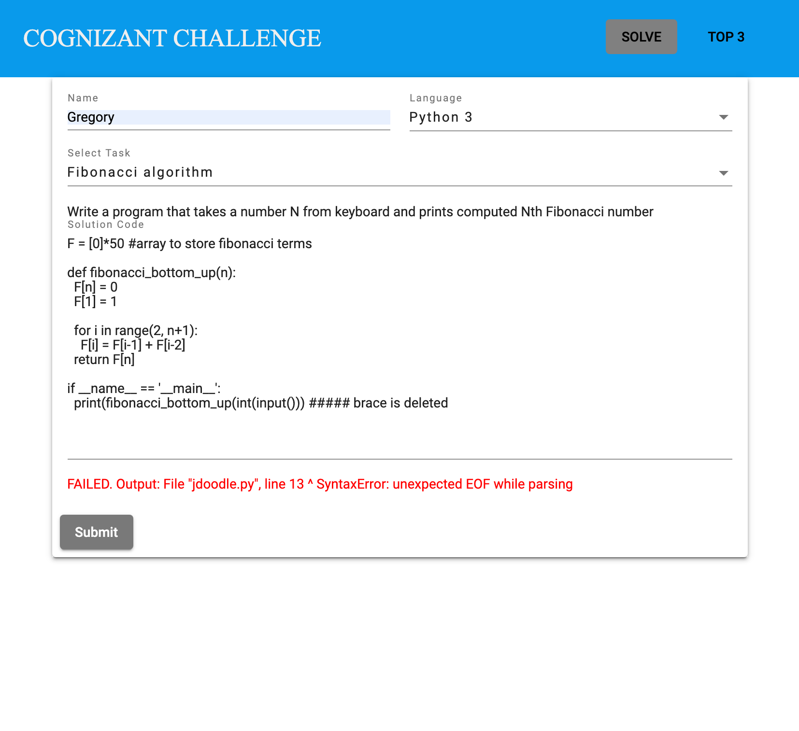

# ProgrammingChallenge

## Overview


[More pictures](readme/)

## How to launch
### Using Docker
1. install Docker
2. open terminal in the root directory of the repo and run
```
docker-compose up
```
3. open [localhost:8086](http://localhost:8086)

### Using nostalgic way
1. check your Ethernet connection
2. install dotnet-sdk 6.x
3. install node.js ~14.x
4. install mssql
5. change database connection string in `src/dotnet-backend/Src/WebApi/appsettings.Development.json` (at least password)
6. launch backend `dotnet run --project ./src/dotnet-backend/Src/WebApi`
7. ensure it successfully connected to a DB
8. launch angular dev-server
```
cd src/angular-frontend
ng serve
```
9. open [localhost:5000](http://localhost:5000)